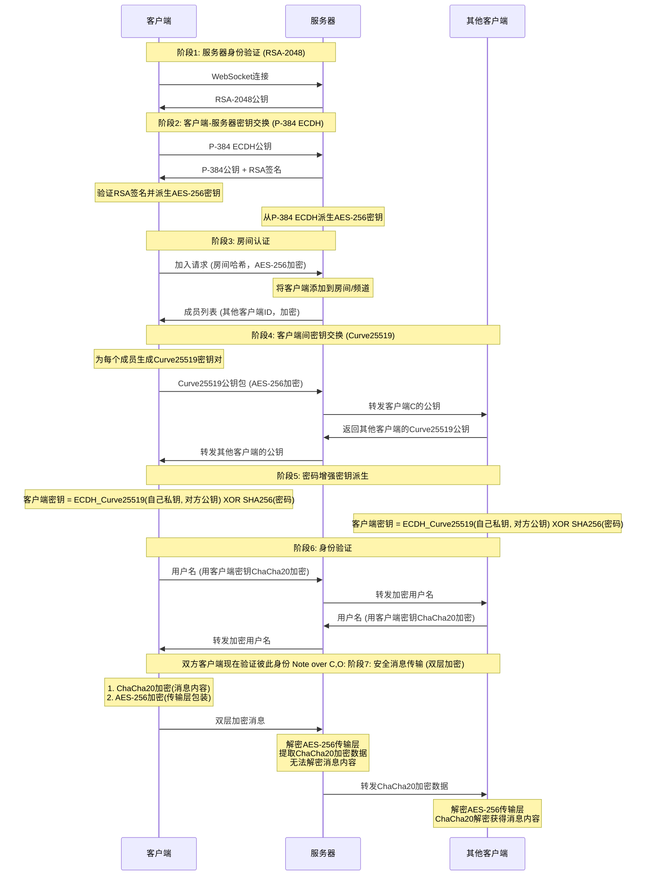

# NodeCrypt

🌐 **[English README](README_EN.md)**

## 🚀 部署说明

### 方法一：一键部署到 Cloudflare Workers

点击下方按钮即可一键部署到 Cloudflare Workers：
[](https://deploy.workers.cloudflare.com/?url=https://github.com/shuaiplus/NodeCrypt)
> 注意：此方式会基于主仓库创建新项目，后续主仓库更新不会自动同步。

### 方法二：自动同步 fork 并部署（推荐长期维护）
1. 先 fork 本项目到你自己的 GitHub 账号。
2. 打开 Cloudflare Workers 控制台，选择“从 GitHub 导入”，并选择你 fork 的仓库进行部署。
> 本项目已内置自动同步 workflow，fork 后无需任何操作，主仓库的更新会自动同步到你的 fork 仓库，Cloudflare 也会自动重新部署，无需手动维护。

### 方法三：Docker 一键部署（推荐自托管）

```bash
docker run -d --name nodecrypt -p 80:80 ghcr.io/shuaiplus/nodecrypt
```


访问 http://localhost:80

### 方法四：本地开发部署
克隆项目并安装依赖后，使用 `npm run dev` 启动开发服务器。
使用 `npm run deploy` 部署到 Cloudflare Workers。

## 📝 项目简介

NodeCrypt 是一个真正的端到端加密聊天系统，实现完全的零知识架构。整个系统设计确保服务器、网络中间人、甚至系统管理员都无法获取任何明文消息内容。所有加密和解密操作都在客户端本地进行，服务器仅作为加密数据的盲中继。

### 系统架构
- **前端**：ES6+ 模块化 JavaScript，无框架依赖
- **后端**：Cloudflare Workers + Durable Objects
- **通信**：WebSocket 实时双向通信
- **构建**：Vite 现代化构建工具

## 🔐 零知识架构设计

### 核心原则
- **服务器盲转**：服务器永远无法解密消息内容，仅负责加密数据中转
- **无数据库存储**：系统不使用任何持久化存储，所有数据仅在内存中临时存在
- **端到端加密**：消息从发送方到接收方全程加密，中间任何节点都无法解密
- **前向安全性**：即使密钥泄露，也无法解密历史消息，因为根本就没有历史消息
- **匿名通信**：用户无需注册真实身份，支持临时匿名聊天
- **多样体验**：和批量发送图片和文件，可选择主题和语言。

### 隐私保护机制

- **实时成员提醒**：房间在线列表完全透明，内任何人加入或离开都会实时通知所有成员，
- **无历史消息**：新加入的用户无法看到任何历史聊天记录
- **私聊加密**：点击用户头像可发起端到端加密的私密对话，房间内其他成员完全无法看到私聊内容

### 房间密码机制

房间密码作为**密钥派生因子**参与端到端加密：`最终共享密钥 = ECDH_共享密钥 XOR SHA256(房间密码)`

- **密码错误隔离**：不同密码的房间无法解密彼此的消息
- **服务器盲区**：服务器永远无法获知房间密码

### 三层安全体系

#### 第一层：RSA-2048 服务器身份验证
- 服务器启动时生成临时 RSA-2048 密钥对，每24小时自动轮换
- 客户端连接时验证服务器公钥，防止中间人攻击
- 私钥仅在服务器内存中存在，从不持久化存储

#### 第二层：ECDH-P384 密钥协商
- 每个客户端生成独立的椭圆曲线密钥对（P-384曲线）
- 通过椭圆曲线 Diffie-Hellman 密钥交换协议建立共享密钥
- 每个客户端与服务器之间拥有独立的加密通道

#### 第三层：混合对称加密
- **服务器通信**：使用 AES-256-CBC 加密客户端与服务器间的控制消息
- **客户端通信**：使用 ChaCha20 加密客户端之间的实际聊天内容
- 每条消息使用独立的初始化向量（IV）和随机数（Nonce）

## 🔄 完整加密流程详解




## 🛠️ 技术实现

- **Web Cryptography API**：浏览器原生加密实现，提供硬件加速
- **elliptic.js**：椭圆曲线密码学库，实现 Curve25519 和 P-384
- **aes-js**：纯 JavaScript AES 实现，支持多种模式
- **js-chacha20**：ChaCha20 流加密算法的 JavaScript 实现
- **js-sha256**：SHA-256 哈希算法实现

## 🔬 安全验证

### 加密过程验证
用户可通过浏览器开发者工具观察完整的加密解密过程，验证消息在传输过程中确实处于加密状态。

### 网络流量分析
使用网络抓包工具可以验证所有 WebSocket 传输的数据都是不可读的加密内容。

### 代码安全审计
所有加密相关代码完全开源，使用标准密码学算法，欢迎安全研究者进行独立审计。

## ⚠️ 安全建议

- **使用强房间密码**：房间密码直接影响端到端加密强度，建议使用复杂密码
- **密码保密性**：房间密码一旦泄露，该房间所有通信内容都可能被解密
- **使用最新版本的现代浏览器**：确保密码学API的安全性和性能

## 🤝 安全贡献

欢迎安全研究者报告漏洞和进行安全审计。严重安全问题将在24小时内修复。

## 📄 开源协议

本项目采用 ISC 开源协议。

## ⚠️ 免责声明

本项目仅供学习和技术研究使用，不得用于任何违法犯罪活动。使用者应遵守所在国家和地区的相关法律法规。项目作者不承担因使用本软件而产生的任何法律责任。请在合法合规的前提下使用本项目。

---
## Star History

[](https://www.star-history.com/#shuaiplus/NodeCrypt&Timeline)

**NodeCrypt** - 真正的端到端加密通信 🔐

*"在数字时代，加密是保护隐私的最后一道防线"*
